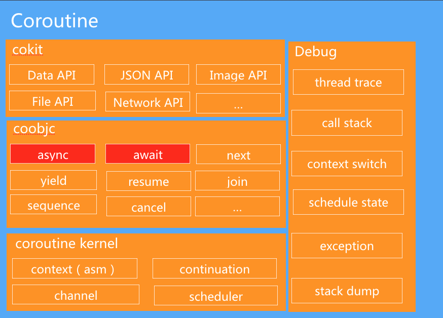

# coobjc



* 底层是协程内核，包括堆栈切换管理，协程调度程序的实现，协程之间通信通道的实现等。
* 中间层是基于协同程序的运算符的包装器。 目前，它支持编程模型，如async / await，generator和Actor。
* 顶层是系统库的协程扩展，目前涵盖了Foundation和UIKit的所有IO和耗时的方法。

coobjc 的架构设计分为以下几块：

- Context切换
- Coroutine的设计
- Scheduler调度器
- Channel设计
- Api设计
- Cancellation设计
- Swift设计

# Context 切换

因为iOS上ucontext是不能使用的，所以我们自己用汇编写了自己的 Context切换。主要包含2个操作 `getcontext` 和 `setcontext`, 分别对 arm64/armv7/x86_64/i386 四个架构做了实现。

下图简单描述了协程如何通过 `getcontext` 和 `setcontext` 实现了 `yield` 和 `resume`的操作。


# Coroutine的设计

- 可暂停恢复

通过 Context切换实现协程的暂停和恢复操作，对应 `yield` 和 `resume` 操作。

- 自建调用栈

自建调用栈，通过单独申请一片内存作为协程执行的栈内存，然后通过`coroutine_makecontext` 构造成协程单独的调用栈内容，再通过 `setcontext` 进入协程。

- 四种状态

Coroutine 有四种状态，READY/RUNNING/SUSPEND/DEAD, 其中RUNNING和 SUSPEND状态可能多次切换。

当进入 DEAD状态，我们会自动释放 Coroutine。

- 可设置userdata

```
void *userdata;                     // Userdata.
coroutine_func userdata_dispose;    // Userdata's dispose action.
```

允许上层传入一个`userdata`，可以用来记录一些额外的信息。在上层Api中就是把 Coroutine的 ObjC 对象传到这里存储，实现了对象生命周期的一致性。

# Scheduler调度器

有了协程，但是协程怎么才能够在我们iOS应用里面用起来呢？怎么和现有的代码进行交互呢？ 协程具体是在哪个线程调度呢？ 于是我们设计了协程调度器 `Scheduler`.

`Scheduler`负责调度所有的用户协程, 它内部管理一个协程队列, 然后不断循环从队列里面拿出协程进行执行, 当队列中没有协程的时候, 就切回线程执行。 

基于这个设计，所以当我们要执行一个协程的时候, 只把协程加入线程的`Scheduler`的队列中, 然后是 `Scheduler` 负责执行它。

`Scheduler`本身也是一个协程。

scheduler调度逻辑如下：


# Channel 的设计

Channel 是 CSP(Communicating Sequential Processes) 并发模型中的 Process/Channel 的实现。 coobjc中的 Channel实现完全参考了 [libtask](https://swtch.com/libtask/) 的实现。

Channel 是协程之间传递数据的通道，中文一般我们叫管道。 Channel的特性是它可以阻塞式发送或接收数据(协程中的阻塞都不是真阻塞，只是yield让出cpu了)。

Channel分为**无buffer**、**有buffer**、**无限buffer**(可自动扩容的有buffer) 模式，下图描述了有无buffer的区别：


Channel的主要特性就是可以block协程, 当从一个协程往一个Channel `send`一个数据时, 如果没有buffer可以存, 那么就会 block 住当前协程，直到另外有地方从这个 Channel中 `receive` 数据。 同理 `receive` 也会 block 当前协程，直到有数据 `send` 到协程。


# Api的设计

前面讲到的关于协程的基础设计都是基于c的实现，那么我们的上层Api是如何设计的呢？

- oc类的封装

 我们封装了 ObjC 的 `COCoroutine` 和 `COChan` 类，用于上层接口来调用。 
 
 - promises
 
 基于[promises](https://github.com/google/promises) 简化了一个 `COPromise`的实现。 
 
 - co_launch/await/yield/co_delay 原语
 
 `co_launch` 是从线程进入协程的入口，是对`COCoroutine`的封装，

`await/yield` 原语是基于 `Channel` 实现的， 利用了 `Channel` 可以阻塞协程的特性。

 `co_delay` 是个delay的实现，底层是使用`dispatch`实现。

# Cancellation设计

协程的取消在 coobjc 中必需**协作完成**，类似NSOperation的取消。因为强行中断代码的执行，可能会造成内存泄露，如下:

```
id obj = ...    // Create a object

await(...)      // await， If we stop here, the cleanup phase will not execute. Cause leak.

obj = nil;      // cleanup
```

协程取消的另一种方式是抛异常，使调用栈回到顶层方法中，看起来是可以安全退出，但是Objective-C中的异常也会导致泄露：https://stackoverflow.com/questions/27140891/why-does-try-catch-in-objective-c-cause-memory-leak ， 因此 coobjc 中的协程我们需要使用方协作完成取消。但是swift中我们就可以通过抛Swift.Error来实现Cancel.

coobjc中协作取消的原理就是，在取消一个协程的时候，我们只是标记它为 `isCancelled`。 如果要设计一个可取消的协程，就需要在代码中判断当前协程是否已取消来退出代码逻辑。

```
// in objc
COCoroutine *co = co_launch(^{
    ...
    await(...)

    // Check the current coroutine is cancelled.
    if (co_isCancelled()) {
        return;
    }
    ...
})
[co cancel];

// in swift
let co = co_launch {
    ...
    await(...)
    ...
}
co.cancel()

```

# Swift 的设计

coswift 的底层共用了一套代码，但是在上层单独设计了一套Swift的接口。利用Swift的泛型和Error的特性，拥有相对于coobjc更佳的使用体验。

- 使用泛型指定Channel和Promise传输的类型。
- Cancellation 不需要协作，直接取消。
- 使用元组