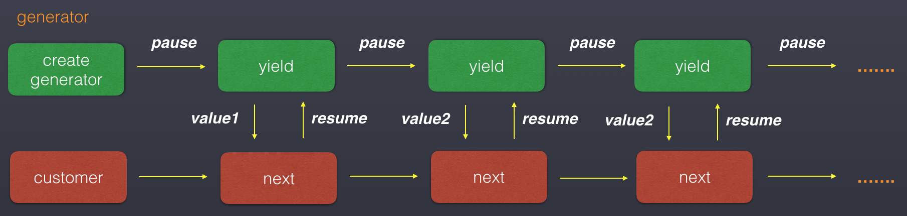
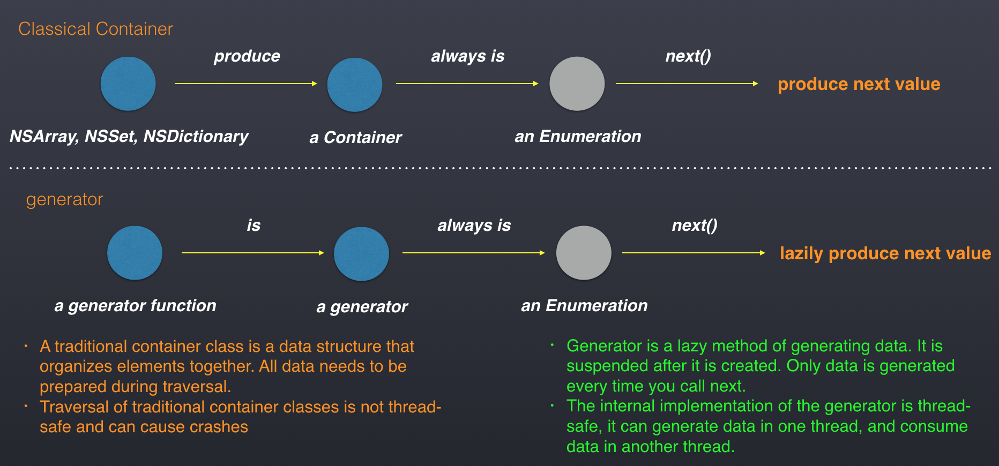
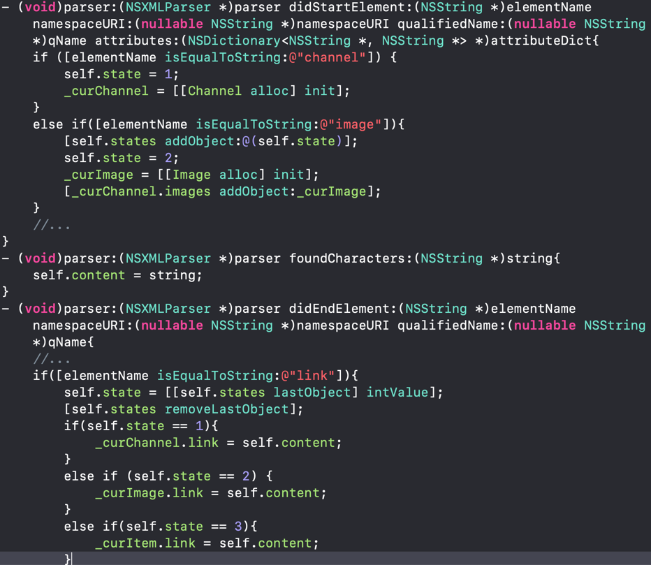
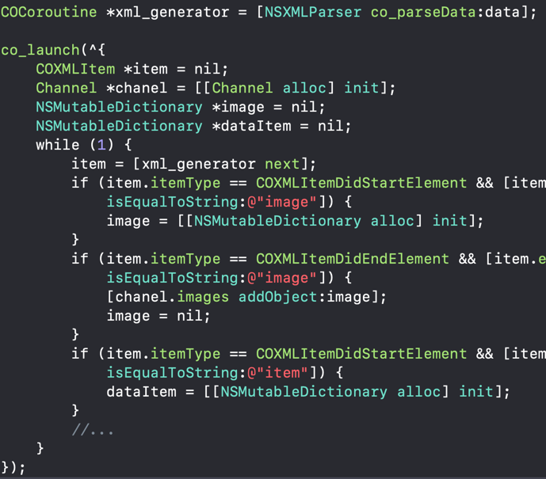
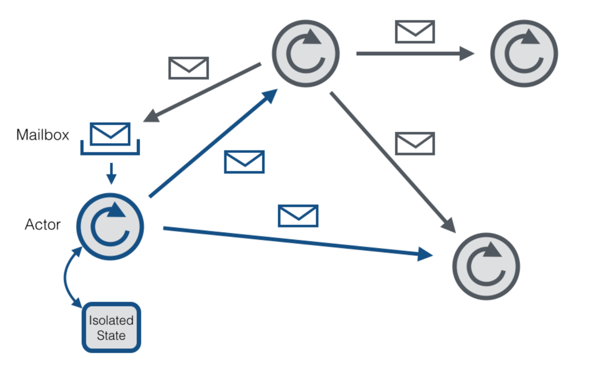
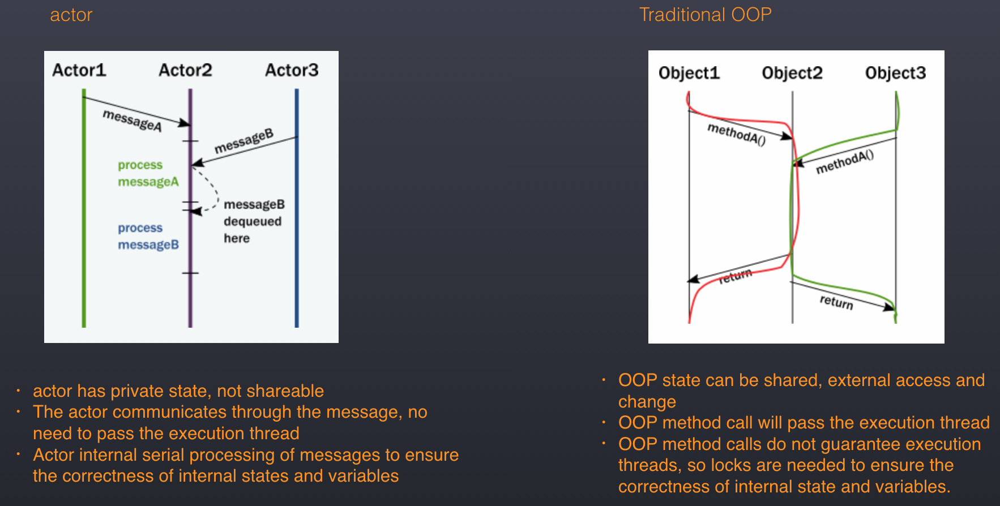
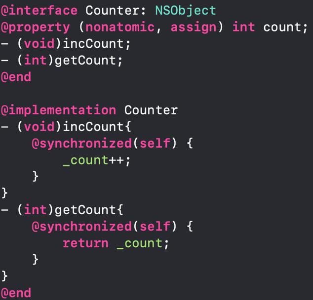

# coobjc usage

This document instroduce how to use coobjc.

<br />(reference：[https://dkandalov.github.io/async-await](https://dkandalov.github.io/async-await))

#### Simple Launch

You can start a coroutine anywhere.

```objc
// Create a coroutine with block, and just resume it.
co_launch(^{
    // do something. The coroutine just asynchronous run in the current `dispath_queue`
});
```

You can create a coroutine, and run it in a specific queue.

```objc
co_launch_onqueue(q, ^{
    // ...
});
```

#### Await

Define a suspendable func with Promises or Channel, then `await` in a coroutine.

```objc
// make a async operation
- (COPromise<id> *)co_fetchSomethingAsynchronous {

    return [COPromise promise:^(COPromiseResolve  _Nonnull resolve, COPromiseReject  _Nonnull reject) {
        dispatch_async(_someQueue, ^{
            id ret = nil;
            NSError *error = nil;
            // fetch result operations
            ...

            if (error) {
                reject(error);
            } else {
                resolve(ret);
            }
        });
    }];
}

// calling in a coroutine.
co_launch(^{

    id ret = await([self co_fetchSomethingAsynchronous]);

    NSError *error = co_getError();
    if (error) {
        // error
    } else {
        // ret
    }
});
```

Define a suspendable func with Channel, then `await` in a coroutine.

```objc
- (COChan<id> *)co_fetchSomething {
    
    COChan *chan = [COChan chan];
    dispatch_async(_someQueue, ^{
       // fetch result operations
       ...
       [chan send_nonblock:result];
    });
    return chan;
}

// calling in a coroutine.
co_launch(^{

    id ret = await([self co_fetchSomething]);
});

```

#### Cancellation 

Cancellation is cooperative.

You should deal with it after cancel. Since ObjC was not suggest to use Exceptions, cause leak actually, 
we can't use Exceptions to cancel a job. So you need code to deal with the cancellation.

Coroutines that have already started can be canceled using cancel
：<br /><br />
```objc
CCOCoroutine *co = co_launch(^{
    val++;
    co_delay(1.0);
    if(co_isCancelled()){
        //Do some cleaning operations
        return;
    }
    val++;
});

[co cancel];
```

After canceling, the code inside the coroutine will not continue to execute, and the memory of the coroutine will be released.

#### Error handling

In the coroutine, all our methods are directly returning the value, and no error is returned. Our error in the execution process is obtained by co_getError()

```objc
// make a async operation
- (COPromise<id> *)co_fetchSomethingAsynchronous {

    COPromise *promise = [COPromise promise:^(COPromiseResolve  _Nonnull resolve, COPromiseReject  _Nonnull reject) {
        dispatch_async(_someQueue, ^{
            id ret = nil;
            NSError *error = nil;
            // fetch result operations
            ...

            if (error) {
                reject(error);
            } else {
                resolve(ret);
            }
        });
    }];

    promise.onCancel = ^(COPromise *pro) {

        // Do the real cancel job here.
    };

    return promise;
}

// calling in a coroutine.
co_launch(^{

    id ret = await([self co_fetchSomethingAsynchronous]);
    
    // we provide the `isActive` just like kotlin's coroutine. is false, means cancelled.
    if (co_isCancelled()) {
        return;
    }

    NSError *error = co_getError();
    if (error) {
        // error
    } else {
        // ret
    }
});

```

#### Sleep in coroutine

In the ios thread, if you want to delay a few seconds, we can write as follows:

```
dispatch_async(async_queue, ^{
    [NSThread sleepWithTimeInterval:5.0];
});
```

Through NSThread sleep will cause the thread to be suspended, the entire thread can not perform other operations<br />In the coroutine, we provide the corresponding co_delay method, which can suspend the current coroutine, but the thread will not pause, other codes can still execute normally.：

```
co_launch(^{
		...
    co_delay(6.0);
    ...
});
```
co_delay can only be called in a coroutine, and calling in a non-coroutine will throw an exception.

#### Use Case
The most important usage scenario for coroutines is asynchronous computing (processing in async/await in languages ​​such as C#). Let's first look at a scenario of asynchronous I/O through traditional callback：<br /><br />
```
//Asynchronous loading of data from the network
[NSURLSession sharedSession].configuration.requestCachePolicy = NSURLRequestReloadIgnoringCacheData;
    NSURLSessionDownloadTask *task = [[NSURLSession sharedSession] downloadTaskWithURL:url completionHandler:
                                      ^(NSURL *location, NSURLResponse *response, NSError *error) {
                                          if (error) {
                                              return;
                                          }

                                          //Parsing data in child threads and generating images                                         
                                          dispatch_async(dispatch_get_global_queue(0, 0), ^{
                                              NSData *data = [[NSData alloc] initWithContentsOfURL:location];
                                              UIImage *image = [[UIImage alloc] initWithData:data];
                                              dispatch_async(dispatch_get_main_queue(), ^{
                                                  //Dispatch to the main thread to display the image 
                                                  imageView.image = image;
                                              });
                                          });

                                      }];
```

The above is a common asynchronous call method in iOS development. We often need to nest callbacks in callbacks. The indentation and logic of the code become more and more complicated. The readability and maintainability of the code will follow the nesting level of the callback. Growth becomes worse and worse, entering the so-called "callback hell" (the nested hell) <br /> The same asynchronous calculation, using the coroutine can be expressed directly (requires a library to provide I to meet the needs of the coroutine) /O interface):

```
co_launch(^{
    NSData *data = await(downloadDataFromUrl(url));
    UIImage *image = await(imageFromData(data));
    imageView.image = image;
});
```

# Generator



Another classic use case for coroutines is lazy computing sequences (processed by yield in languages ​​such as C# and Python). This lazy calculation sequence can be generated by sequential execution of the code, only when needed:<br /><br />
```
COSequence *fibonacci = co_sequence(^{
        yield(@(1));
        int cur = 1;
        int next = 1;
        while(1){
            yield(@(next));
            int tmp = cur + next;
            cur = next;
            next = tmp;
        }
    });
```

This code creates a lazy loaded Fibonacci sequence, we can get the value of the sequence, by take or next:<br /><br />
```
for(id val in fibonacci){
    NSLog(@"%@", val);
}

id val = [fibonacci next];
NSArray* list = [fibonacci take:5]
```


#### The difference between the traditional container class and the generator



#### create generator

We use co_sequence to create the generator

```
COCoroutine *co1 = co_sequence(^{
            int index = 0;
            while(co_isActive()){
                yield_val(@(index));
                index++;
            }
        });
```

In other coroutines, we can call the next method to get the data in the generator.

```
co_launch(^{
            for(int i = 0; i < 10; i++){
                val = [[co1 next] intValue];
            }
        });
```

#### cancel execution

Generator cancellation by calling the cancel method

```
co_launch(^{
            [co1 cancel];
        });
```

#### use case

The generator can be used in many scenarios, such as message queues, batch download files, bulk load caches, etc.:

```
int unreadMessageCount = 10;
NSString *userId = @"xxx";
COSequence *messageSequence = sequenceOnBackgroundQueue(@"message_queue", ^{
   //thread execution in the background
    while(1){
        yield(queryOneNewMessageForUserWithId(userId));
    }
});

//Main thread update UI
co(^{
   for(int i = 0; i < unreadMessageCount; i++){
       if(!isQuitCurrentView()){
           displayMessage([messageSequence take]);
       }
   }
});
```

Through the generator, we can load the data from the traditional producer--notifying the consumer model, turning the consumer into the data-->telling the producer to load the pattern, avoiding the need to use many shared variables for the state in multi-threaded computing. Synchronization eliminates the use of locks in certain scenarios<br /><br />

#### Example

We next demonstrate how to use the Generator for XML parsing. The traditional XML parsing is as follows:



We need to set up the Delegate and handle all the parsing logic in the Delegate.

After parsing with Generator, our code logic becomes the following way:



We can traverse the parsing in a loop, which is simpler and more convenient. Especially for large XML files, we can only parse a part and then cancel, which can save more memory.

# Actor

> **_The concept of Actor comes from Erlang. In AKKA, an Actor can be thought of as a container for storing state, behavior, Mailbox, and child Actor and Supervisor policies. Actors do not communicate directly, but use Mail to communicate with each other._**



(reference: https://cwiki.apache.org/confluence/display/FLINK/Akka+and+Actors)

Mailbox: the queue that stores the message<br />Isolated State: the state of the actor, internal variables, etc.<br />message: A parameter similar to the OOP method call<br />
The implementation of the Actor model has two characteristics: <br /> 1. Each Actor, in a single thread, sequentially executes the message sent to it. <br /> 2. Different Actors can execute their messages at the same time.

#### create actor

We can use co_actor_onqueue to create an actor in the specified thread.

```
CCOActor *actor = co_actor_onqueue(^(CCOActorChan *channel) {
    ...  //Define the state variable of the actor

    for(CCOActorMessage *message in channel){
        ...//handle message
    }
}, q);
```

#### send a message to the actor

The actor's send method can send a message to the actor

```
CCOActor *actor = co_actor_onqueue(^(CCOActorChan *channel) {
    ...  //Define the state variable of the actor

    for(CCOActorMessage *message in channel){
        ...//handle message
    }
}, q);

// send a message to the actor
[actor send:@"sadf"];
[actor send:@(1)];

```

#### cancel execution

```
CCOActor *actor = co_actor_onqueue(^(CCOActorChan *channel) {
    ...  //Define the state variable of the actor

    for(CCOActorMessage *message in channel){
        ...//handle message
    }
}, q);
}, q);

//cancel
[actor cancel];
```

#### use case

The thread security problem in the traditional concurrent programming mode is more serious. In iOS application development, we can use GCD, NSOperationQueue, NSThread, pthread, etc. to create threads, and then execute the business logic in the thread we create ourselves, once it involves more Thread calls, there will inevitably be a problem of multi-thread security <br /><br /><br />First let us look at the reference counting operation, the Objective-C object includes a reference count field to store the How many times the object has been referenced, this field is modified using atomic operations. Atomic operations ensure that the reference count field itself does not go wrong in the case of multithreaded contention. However, using reference counting is not enough to ensure thread safety. <br /><br />

The existing idea of ​​object-oriented programming is very prone to problems, because the methods and properties of the class are exposed to the caller, the caller can call in any thread, but the thread is often not the thread envisioned by the provider of the library. Once thread safety issues arise, the library designer will try to fix it by locking it. Over and over, more and more lock problems are exposed.<br />In theory, we can design through reasonable design. Make multi-threaded task execution more reasonable, and tell the user how to properly call the interface we designed through rich documentation and examples, but this problem is not completely solved by relying on manual design and documentation, because everything depends on Design and communication to solve the problem, will eventually lead to new problems due to negligence<br /><br /><br /><br /><br /><br />Using the Actor programming model can help us design a thread-safe module.

#### example

In the traditional way, if we want to implement a counter, we can do as follows：



The traditional way to ensure thread safety through locks, then using Actor, we can use the following way:


# Actual case using coobjc
Let's take the code of the Feeds stream update in the GCDFetchFeed open source project as an example to demonstrate the actual usage scenarios and advantages of the coroutine. The following is the original implementation of not using coroutine：

```
- (RACSignal *)fetchAllFeedWithModelArray:(NSMutableArray *)modelArray {
    @weakify(self);
    return [RACSignal createSignal:^RACDisposable *(id<RACSubscriber> subscriber) {
        @strongify(self);
        //Create a parallel queue
        dispatch_queue_t fetchFeedQueue = dispatch_queue_create("com.starming.fetchfeed.fetchfeed", DISPATCH_QUEUE_CONCURRENT);
        dispatch_group_t group = dispatch_group_create();
        self.feeds = modelArray;
        for (int i = 0; i < modelArray.count; i++) {
            dispatch_group_enter(group);
            SMFeedModel *feedModel = modelArray[i];
            feedModel.isSync = NO;
            [self GET:feedModel.feedUrl parameters:nil progress:nil success:^(NSURLSessionTask *task, id responseObject) {
                dispatch_async(fetchFeedQueue, ^{
                    @strongify(self);
                    //parse feed
                    self.feeds[i] = [self.feedStore updateFeedModelWithData:responseObject preModel:feedModel];
                    //save to db
                    SMDB *db = [SMDB shareInstance];
                    @weakify(db);
                    [[db insertWithFeedModel:self.feeds[i]] subscribeNext:^(NSNumber *x) {
                        @strongify(db);
                        SMFeedModel *model = (SMFeedModel *)self.feeds[i];
                        model.fid = [x integerValue];
                        if (model.imageUrl.length > 0) {
                            NSString *fidStr = [x stringValue];
                            db.feedIcons[fidStr] = model.imageUrl;
                        }
                        //sendNext
                        [subscriber sendNext:@(i)];
                        //Notification single completion
                        dispatch_group_leave(group);
                    }];
                    
                });//end dispatch async
                
            } failure:^(NSURLSessionTask *operation, NSError *error) {
                NSLog(@"Error: %@", error);
                dispatch_async(fetchFeedQueue, ^{
                    @strongify(self);
                    [[[SMDB shareInstance] insertWithFeedModel:self.feeds[i]] subscribeNext:^(NSNumber *x) {
                        SMFeedModel *model = (SMFeedModel *)self.feeds[i];
                        model.fid = [x integerValue];
                        dispatch_group_leave(group);
                    }];
                    
                });//end dispatch async
                
            }];
            
        }//end for
        //Execution event after all is completed
        dispatch_group_notify(group, dispatch_get_main_queue(), ^{
            [subscriber sendCompleted];
        });
        return nil;
    }];
}
```

The following is the call to the above method in viewDidLoad:

```
    [UIApplication sharedApplication].networkActivityIndicatorVisible = YES;
    self.fetchingCount = 0; 
    @weakify(self);
    [[[[[[SMNetManager shareInstance] fetchAllFeedWithModelArray:self.feeds] map:^id(NSNumber *value) {
        @strongify(self);
        NSUInteger index = [value integerValue];
        self.feeds[index] = [SMNetManager shareInstance].feeds[index];
        return self.feeds[index];
    }] doCompleted:^{
        @strongify(self);
        NSLog(@"fetch complete");
        self.tbHeaderLabel.text = @"";
        self.tableView.tableHeaderView = [[UIView alloc] init];
        self.fetchingCount = 0;
        [self.tableView.mj_header endRefreshing];
        [self.tableView reloadData];
        if ([SMFeedStore defaultFeeds].count > self.feeds.count) {
            self.feeds = [SMFeedStore defaultFeeds];
            [self fetchAllFeeds];
        }
        [self cacheFeedItems];
    }] deliverOn:[RACScheduler mainThreadScheduler]] subscribeNext:^(SMFeedModel *feedModel) {
        @strongify(self);
        self.tableView.tableHeaderView = self.tbHeaderView;
        self.fetchingCount += 1;
        self.tbHeaderLabel.text = [NSString stringWithFormat:@"正在获取%@...(%lu/%lu)",feedModel.title,(unsigned long)self.fetchingCount,(unsigned long)self.feeds.count];
        feedModel.isSync = YES;
        [self.tableView reloadData];
    }];

```

The above code is relatively poor in terms of readability and simplicity. Let's take a look at the code after using the coroutine transformation:

```
- (SMFeedModel*)co_fetchFeedModelWithUrl:(SMFeedModel*)feedModel{
    feedModel.isSync = NO;
    id response = await([self co_GET:feedModel.feedUrl parameters:nil]);
    if (response) {
        SMFeedModel *resultModel = await([self co_updateFeedModelWithData:response preModel:feedModel]);
        int fid = [[SMDB shareInstance] co_insertWithFeedModel:resultModel];
        resultModel.fid = fid;
        if (resultModel.imageUrl.length > 0) {
            NSString *fidStr = [@(fid) stringValue];
            [SMDB shareInstance].feedIcons[fidStr] = resultModel.imageUrl;
        }
        return resultModel;
    }
    int fid = [[SMDB shareInstance] co_insertWithFeedModel:feedModel];
    feedModel.fid = fid;
    return nil;
}
```

Here is the place in viewDidLoad that uses the coroutine to call the interface:

```
co_launch(^{
    for (NSUInteger index = 0; index < self.feeds.count; index++) {
        SMFeedModel *model = self.feeds[index];
        self.tableView.tableHeaderView = self.tbHeaderView;
        self.tbHeaderLabel.text = [NSString stringWithFormat:@"正在获取%@...(%lu/%lu)",model.title,(unsigned long)(index + 1),(unsigned long)self.feeds.count];
        model.isSync = YES;
        SMFeedModel *resultMode = [[SMNetManager shareInstance] co_fetchFeedModelWithUrl:model];
        if (resultMode) {
            self.feeds[index] = resultMode;
            [self.tableView reloadData];
        }
    }
    self.tbHeaderLabel.text = @"";
    self.tableView.tableHeaderView = [[UIView alloc] init];
    self.fetchingCount = 0;
    [self.tableView.mj_header endRefreshing];
    [self.tableView reloadData];
    [self cacheFeedItems];
});
```

The code after the coroutine transformation has become easier to understand and less error-prone.


# Tuple
#### create tuple
we provide co_tuple method to create tuple

```objc
COTuple *tup = co_tuple(nil, @10, @"abc");
NSAssert(tup[0] == nil, @"tup[0] is wrong");
NSAssert([tup[1] intValue] == 10, @"tup[1] is wrong");
NSAssert([tup[2] isEqualToString:@"abc"], @"tup[2] is wrong");
```
you can store any value in tuple

#### unpack tuple
we provide co_unpack method to unpack tuple

```objc
id val0;
NSNumber *number = nil;
NSString *str = nil;
co_unpack(&val0, &number, &str) = co_tuple(nil, @10, @"abc");
NSAssert(val0 == nil, @"val0 is wrong");
NSAssert([number intValue] == 10, @"number is wrong");
NSAssert([str isEqualToString:@"abc"], @"str is wrong");

co_unpack(&val0, &number, &str) = co_tuple(nil, @10, @"abc", @10, @"abc");
NSAssert(val0 == nil, @"val0 is wrong");
NSAssert([number intValue] == 10, @"number is wrong");
NSAssert([str isEqualToString:@"abc"], @"str is wrong");

co_unpack(&val0, &number, &str, &number, &str) = co_tuple(nil, @10, @"abc");
NSAssert(val0 == nil, @"val0 is wrong");
NSAssert([number intValue] == 10, @"number is wrong");
NSAssert([str isEqualToString:@"abc"], @"str is wrong");

NSString *str1;

co_unpack(nil, nil, &str1) = co_tuple(nil, @10, @"abc");
NSAssert([str1 isEqualToString:@"abc"], @"str1 is wrong");
```

#### use tuple in coroutine
first create a promise that resolve tuple value

```objc
COPromise<COTuple*>*
cotest_loadContentFromFile(NSString *filePath){
    return [COPromise promise:^(COPromiseFulfill  _Nonnull resolve, COPromiseReject  _Nonnull reject) {
        if ([[NSFileManager defaultManager] fileExistsAtPath:filePath]) {
            NSData *data = [[NSData alloc] initWithContentsOfFile:filePath];
            resolve(co_tuple(filePath, data, nil));
        }
        else{
            NSError *error = [NSError errorWithDomain:@"fileNotFound" code:-1 userInfo:nil];
            resolve(co_tuple(filePath, nil, error));
        }
    }];
}
```

then you can fetch the value like this:

```
co_launch(^{
    NSString *tmpFilePath = nil;
    NSData *data = nil;
    NSError *error = nil;
    co_unpack(&tmpFilePath, &data, &error) = await(cotest_loadContentFromFile(filePath));
    XCTAssert([tmpFilePath isEqualToString:filePath], @"file path is wrong");
    XCTAssert(data.length > 0, @"data is wrong");
    XCTAssert(error == nil, @"error is wrong");
});
```
use tuple you can get multiple values from await return


